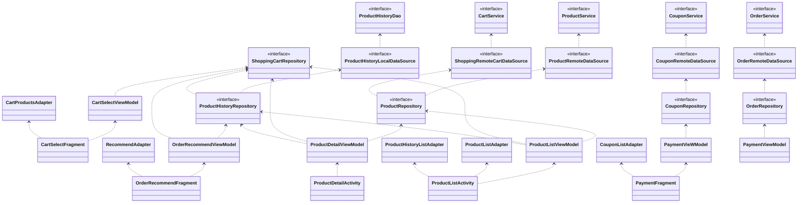

# android-shopping-order

### 기능 요구 사항

- [x] 데이터가 로딩되기 전 상태에서는 스켈레톤 UI를 노출한다.
- [x] 서버를 연동한다.
- [x] 사용자 인증 정보를 저장한다. (적절한 저장 방법을 선택한다)
- [x] 장바구니 화면에서 특정 상품만 골라 주문하기 버튼을 누를 수 있다. 
- [x] 별도의 화면에서 상품 추천 알고리즘으로 사용자에게 적절한 상품을 추천해준다.
- [x] 상품 추천 알고리즘은 최근 본 상품 카테고리를 기반으로 최대 10개 노출한다. 
  - [x] 예를 들어 가장 최근에 본 상품이 fashion 카테고리라면, fashion 상품 10개 노출 
  - [x] 해당 카테고리 상품이 10개 미만이라면 해당하는 개수만큼만 노출 
  - [x] 장바구니에 이미 추가된 상품이라면 미노출 
- [x] 추천된 상품을 해당 화면에서 바로 추가하여 같이 주문할 수 있다.
- [x] 결제 화면에서 적용 가능한 쿠폰을 조회하고 적용할 수 있다.
  - [x] 적용 가능한 쿠폰만 불러온다.  
  - [x] 쿠폰은 1개만 적용 가능하다.
  - [x] 기본 배송비는 3000원이다.
  - [x] 주문목록 리스트에서 주문 완료 토스트 메시지를 띄운다.

### Low Level Design 

#### Static

#### Dynamic

