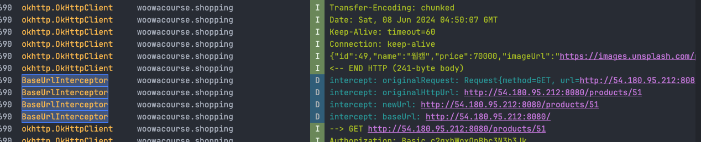

# Multiple Domain Handling Study

찾아보니까 여러 방법이 있네요.


## 1. 여러 레트로핏 서비슬르 만든다.

```kotlin
object RetrofitServiceFactory {

    fun createService(baseUrl: String): Retrofit {
        return Retrofit.Builder()
            .baseUrl(baseUrl)
            .client(okHttpClient)
            .addConverterFactory(nullOnEmptyConverterFactory)
            .addConverterFactory(GsonConverterFactory.create())
            .build()
    }
}

// Usage example
val service1 = RetrofitServiceFactory.createService("https://api.example.com")
val service2 = RetrofitServiceFactory.createService("https://api.otherexample.com")

```

쉽지만, 일일이 service 객체마다 baseurl 을 만들어주는 것은 동적으로 생성되지 않아서 유연성, 확장성이 없음.  

## 2. 커스텀 인터셉터를 만들어서 동적으로 BASE URL 을 변경
```kotlin
class BaseUrlInterceptor : Interceptor {
    @Volatile private var baseUrl: HttpUrl? = null

    fun setBaseUrl(url: String) {
        this.baseUrl = url.toHttpUrlOrNull()
    }

    override fun intercept(chain: Interceptor.Chain): Response {
        val originalRequest = chain.request()
        val originalHttpUrl = originalRequest.url

        Log.d(TAG, "intercept: originalRequest: $originalRequest")
        Log.d(TAG, "intercept: originalHttpUrl: $originalHttpUrl")

        // base URL 만 바꾸어 주는 동작!! (scheme + host + port)
        val newUrl = baseUrl?.let {
            originalHttpUrl.newBuilder()
                .scheme(it.scheme)
                .host(it.host)
                .port(it.port)
                .build()
        }

        Log.d(TAG, "intercept: newUrl: $newUrl")
        Log.d(TAG, "intercept: baseUrl: $baseUrl")

        val newRequest = newUrl?.let {
            originalRequest.newBuilder().url(it).build()
        } ?: originalRequest

        return chain.proceed(newRequest)
    }

    companion object {
        private const val TAG = "BaseUrlInterceptor"
    }
}


object RetrofitService {
    // ...
    val baseUrlInterceptor = BaseUrlInterceptor()

    private val okHttpClient =
        OkHttpClient.Builder()
            .addInterceptor(BasicAuthInterceptor(BuildConfig.BASIC_AUTH_USER_DEV, BuildConfig.BASIC_AUTH_PASSWORD_DEV))
            .addInterceptor(baseUrlInterceptor) // ✅✅✅ ADD INTERCEPTOR!
            .addInterceptor(logging)
            .build()
    
    // ...
    
    val retrofitService: Retrofit =
        Retrofit.Builder()
            .baseUrl(BuildConfig.BASE_URL_DEV)
            .client(okHttpClient)
            .addConverterFactory(nullOnEmptyConverterFactory)
            .addConverterFactory(GsonConverterFactory.create())
            .build()
}

```

```kotlin
class ProductRemoteDataSource(private val productsApiService: ProductsApiService) : ProductDataSource {
    init {
        RetrofitService.baseUrlInterceptor.setBaseUrl(BuildConfig.BASE_URL_DEV) // 다른 base url 이 없어서 그냥 기거로 함.
    }
    // ...
}


```

이런 식으로 각 데이터 소스에서 url interceptor 를 생성자 주입하고, url 을 파라미터로 넘겨서 사용할 수 있다.  
미션에서는 하나의 baseurl 만 있어서 직접 적용하기 힘들어 로그를 찍어보니.. 

잘 되는 듯??  
대신에 datasource 에서 계속 set 을 해주어야 하고,  
RetrofitService 에 어디서든지 접근해서 setBaseUrl 을 해줄 수 있게 공개되어 있다는 단점이 있는 듯?  

물론 BaseUrlInterceptor 을 생성자 주입해 줄 수도 있지만, 그렇게 되면, 계속해서 remoteDataSource 에 생성자 주입을 해주어야 해서 번거로울 수 있음.  

다른 방법 찾아보자.  

## 3. Retrofit 의 baseUrl 을 동적으로 변경하는 방법


