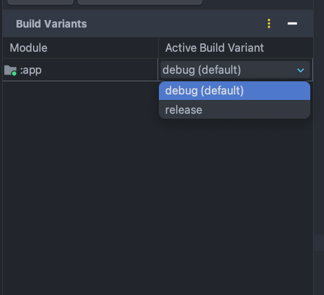

# local.properties

### local.properties

이 파일은 .gitignore 파일에 포함되어 있다.  
보안에 중요한 데이터를 저장하기에 좋다.  

개발을 하면서 개발 서버용, staging 서버용(pre-production), 프로덕션용 URL 들을 저장하고는 한다.  

인증 자격 정보도 저장한다.  
Basic Auth 를 사용하고 있는데, 그에 사용되는 user 와 password 를 저장한다.  

다른 third party 서비스에 대한 키도 저장할 수 있다.
ex: FIREBASE_API_KEY, GOOGLE_MAPS_API_KEY etc.

ex: SMTP_SERVER=smtp.example.com
```
SMTP_PORT=587
SMTP_USER=emailUser
SMTP_PASSWORD=emailPass
```

ex: 빌드하는 버전 정보
```
VERSION_NAME=1.0.0
VERSION_CODE=1
```

등,,,

사실 실제로는 sensitive 한 서비스에 대한 API key, 비밀번호, 또는 access token 같은 프로덕션 secret 을 저장하면 안된다고 한다.  
대신에 보다 더 안전한 방법을 사용해야 한다.  
 
그리고 크거나 복잡한 데이터는 저장하지 말아야 한다.   
전용 구성 파일이나 서비스를 사용했을 때 위 데이터를 더 관리하기 좋다면 그렇게 하자.  


### 어케 쓰지?
local.properties
```
# Development Environment
BASE_URL_DEV=http://dev.example.com
BASIC_AUTH_USER_DEV=devUser
BASIC_AUTH_PASSWORD_DEV=devPass

# Production Environment
BASE_URL_PROD=http://prod.example.com
BASIC_AUTH_USER_PROD=prodUser
BASIC_AUTH_PASSWORD_PROD=prodPass
```

### Configuration 이라는 객체 만들기
```kotlin
object Configuration {
    private val properties: Properties = Properties().apply {
        val propertiesFile = FileInputStream("local.properties")
        load(propertiesFile)
    }

    val baseUrl: String
        get() = properties.getProperty("BASE_URL")

    val basicAuthUser: String
        get() = properties.getProperty("BASIC_AUTH_USER")

    val basicAuthPassword: String
        get() = properties.getProperty("BASIC_AUTH_PASSWORD")
}
```

위와 같은 객체를 만들어서 RetrofitService 에서 참조하기!
```kotlin
object RetrofitService {
    // ...

    private val okHttpClient =
        OkHttpClient.Builder()
            // 여기!!👇
            .addInterceptor(BasicAuthInterceptor(Configuration.BASIC_AUTH_USER, Configuration.BASIC_AUTH_PASSWORD))
            .addInterceptor(logging)
            .build()
    
    // ....
    
    val retrofitService: Retrofit =
        Retrofit.Builder()
            // 여기!!👇
            .baseUrl(Configuration.BASE_URL)
            .client(okHttpClient)
            .addConverterFactory(nullOnEmptyConverterFactory)
            .addConverterFactory(GsonConverterFactory.create())
            .build()
```

간편하다!

### 다른 방법. BuildConfig 를 만들기

build.gradle.kts
```kotlin


android {
    // ...
    fun loadProperties(fileName: String): Properties {
        val properties = Properties()
        val file = project.rootProject.file(fileName)
        if (file.exists()) {
            properties.load(FileInputStream(file))
        }
        return properties
    }

    val localProperties = loadProperties("local.properties")

    val baseUrlDev: String = localProperties.getProperty("BASE_URL_DEV")
    val basicAuthUserDev: String = localProperties.getProperty("BASIC_AUTH_USER_DEV")
    val basicAuthPasswordDev: String = localProperties.getProperty("BASIC_AUTH_PASSWORD_DEV")

    val baseUrlProd: String = localProperties.getProperty("BASE_URL_PROD")
    val basicAuthUserProd: String = localProperties.getProperty("BASIC_AUTH_USER_PROD")
    val basicAuthPasswordProd: String = localProperties.getProperty("BASIC_AUTH_PASSWORD_PROD")

    buildTypes {
        debug{
            buildConfigField(type = "String", name = "BASE_URL_DEV", value = "\"$baseUrlDev\"")
            buildConfigField("String", "BASIC_AUTH_USER_DEV", "\"$basicAuthUserDev\"")
            buildConfigField("String", "BASIC_AUTH_PASSWORD_DEV", "\"$basicAuthPasswordDev\"")
        }

        release {
            isMinifyEnabled = false
            buildConfigField("String", "BASE_URL_PROD", "\"$baseUrlProd\"")
            buildConfigField("String", "BASIC_AUTH_USER_PROD", "\"$basicAuthUserProd\"")
            buildConfigField("String", "BASIC_AUTH_PASSWORD_PROD", "\"$basicAuthPasswordProd\"")
            proguardFiles(
                getDefaultProguardFile("proguard-android-optimize.txt"),
                "proguard-rules.pro",
            )
        }
    // ...

    buildFeatures {
        buildConfig = true
    }
}
```
clean & rebuild project 하면, Build Config 라는 파일이 생긴다.

```java
public final class BuildConfig {
  public static final boolean DEBUG = Boolean.parseBoolean("true");
  public static final String APPLICATION_ID = "woowacourse.shopping";
  public static final String BUILD_TYPE = "debug";
  public static final int VERSION_CODE = 1;
  public static final String VERSION_NAME = "1.0";
  // Field from build type: debug
  public static final String BASE_URL = "http://54.180.95.212:8080";
  // Field from build type: debug
  public static final String BASIC_AUTH_PASSWORD = "password";
  // Field from build type: debug
  public static final String BASIC_AUTH_USER = "sh1mj1";
}

```
build.gradle.kts 에서 이러한 프로퍼티를 BuildConfig 에 전달할 수 있다.  
이렇게 해서 앱에서 debug, staging , release 개발 환경에 따라 다른 서버 URL 을 사용할 수 있다.

그래서 이것을 참조해서 사용하면 된다..

```kotlin
object RetrofitService {
    // ...

    private val okHttpClient =
        OkHttpClient.Builder()
            // 여기!!👇
            .addInterceptor(BasicAuthInterceptor(BuildConfig.BASIC_AUTH_USER, BuildConfig.BASIC_AUTH_PASSWORD))
            .addInterceptor(logging)
            .build()
    
    // ....
    
    val retrofitService: Retrofit =
        Retrofit.Builder()
            // 여기!!👇
            .baseUrl(BuildConfig.BASE_URL)
            .client(okHttpClient)
            .addConverterFactory(nullOnEmptyConverterFactory)
            .addConverterFactory(GsonConverterFactory.create())
            .build()

```


build.variants 에서  이런식으로 사용할 수 있다고 하는데. 안되네?

ERROR
```
Error: The apk for your currently selected variant cannot be signed.
Please specify a signing configuration for this variant (release).
```
local.properties 에서 
```
# Keystore properties
STORE_FILE=path/to/your/keystore/my-release-key.jks
STORE_PASSWORD=your_store_password
KEY_ALIAS=my-key-alias
KEY_PASSWORD=your_key_password
 
```

build.gradle.kts 에서
```
    **signingConfigs {
        create("release") {
            keyAlias = localProperties.getProperty("KEY_ALIAS")
            keyPassword = localProperties.getProperty("KEY_PASSWORD")
            storeFile = file(localProperties.getProperty("STORE_FILE") ?: "")
            storePassword = localProperties.getProperty("STORE_PASSWORD")
        }
    }**

    buildTypes {
        debug {
            buildConfigField("String", "BASE_URL", "\"http://54.180.95.212:8080\"")
            buildConfigField("String", "BASIC_AUTH_USER", "\"sh1mj1\"")
            buildConfigField("String", "BASIC_AUTH_PASSWORD", "\"password\"")
        }
        release {
            **isMinifyEnabled = true
            proguardFiles(getDefaultProguardFile("proguard-android-optimize.txt"), "proguard-rules.pro")
            signingConfig = signingConfigs.getByName("release")**
            buildConfigField("String", "BASE_URL", "\"http://54.180.95.212:8080\"")
            buildConfigField("String", "BASIC_AUTH_USER", "\"sh1mj1\"")
            buildConfigField("String", "BASIC_AUTH_PASSWORD", "\"password\"")
        }
    }

    flavorDimensions("environment")
    productFlavors {
        create("dev") {
            dimension = "environment"
            buildConfigField("String", "BASE_URL", "\"http://54.180.95.212:8080\"")
            buildConfigField("String", "BASIC_AUTH_USER", "\"devUser\"")
            buildConfigField("String", "BASIC_AUTH_PASSWORD", "\"devPassword\"")
        }
        create("prod") {
            dimension = "environment"
            buildConfigField("String", "BASE_URL", "\"http://54.180.95.212:8080\"")
            buildConfigField("String", "BASIC_AUTH_USER", "\"prodUser\"")
            buildConfigField("String", "BASIC_AUTH_PASSWORD", "\"prodPassword\"")
        }
    }
```
이런 식으로 해야 한다고 하는데,  
너무 토끼굴이니까 이정도만 알아보자.

정확히 어떻게 사용하는 건지는 나중에 알아보자.

